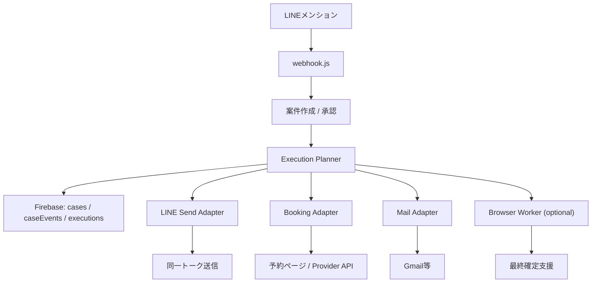

# ノブレス自動実行設計メモ

最終更新: 2026-04-24
対象ブランチ: `feature/linebot`

## 1. 目的

ノブレスモードを、単なる「相談整理」から

- 送信
- 予約
- 購入

まで見据えた実行型秘書に進化させる。

ただし、今の無料構成と誤爆リスクを踏まえて、次の原則を守る。

1. 無断送信より無送信を優先する
2. 無断課金より未実行を優先する
3. 外部サービスの最終確定は、別確認を基本にする
4. すべての実行は案件ログに残す

## 2. 現在地

本番 `954b393` 時点で、ノブレスはここまで対応済み。

- 案件化
- 案A / 案B / 案C 承認
- お店 / ホテル / 経路 / タクシー / フライト導線
- 文面草案 / 日程文面の生成
- 未入力がない文面のLINE送信
- 店 / ホテル選択後の共有送信
- 案件イベントログ表示

まだ未対応なのはここ。

- メール実送信
- 外部サイトでの予約最終確定
- 購入確定
- 支払い情報を伴う処理
- 連携アカウントの安全な保持

## 3. 設計原則

### 3-1. 実行レベルを分ける

| レベル | 内容 | 例 |
|---|---|---|
| L0 | 提案のみ | 案A/B/C |
| L1 | 下書き生成 | 文面草案、予約共有文 |
| L2 | 同一LINEトーク送信 | グループへの共有送信 |
| L3 | 外部導線起動 | 予約ページを開く、電話リンク |
| L4 | 外部送信 | Gmail API送信、Slack投稿 |
| L5 | 外部予約確定 | 宿予約の最終送信 |
| L6 | 課金 / 購入確定 | 決済、注文確定 |

運用方針:

- 既存無料構成の標準は `L3` まで
- `L4` は連携済みユーザーのみ
- `L5` 以降は個別許可制
- `L6` は別系統。標準機能にはしない

### 3-2. 二段階承認

高影響操作は必ず次の2段階にする。

1. 案件承認
2. 実行承認

例:

- `案Cで進める`
- `この文面を送信`
- `このホテルで進める`
- `最終予約を確定`

### 3-3. 実行は必ず冪等にする

同じ postback が二重で来ても、二重送信・二重予約・二重購入を避ける。

そのために各実行は `executionId` を持ち、

- `planned`
- `running`
- `done`
- `failed`
- `cancelled`

の状態を持つ。

### 3-4. 支払い情報は保存しない

Bot自身はクレジットカード番号や決済パスワードを保持しない。

購入に踏み込む場合でも、

- 外部ウォレット
- Provider側の保存済み決済
- 人間の最終確定

を前提にする。

## 4. 推奨アーキテクチャ



## 5. データ構造の追加案

Realtime Database に次を追加する。

```text
/noblesse/cases/{caseId}
  executionPolicy:
    maxLevel: 3|4|5
    finalPurchaseAllowed: false
    finalReservationAllowed: false
  preparedSend:
    kind: "message" | "schedule" | "decision"
    title: string
    text: string
    allowImmediateSend: boolean
  selectionCandidates:
    type: "restaurant" | "hotel"
    items: Candidate[]

/noblesse/executions/{executionId}
  caseId: string
  sourceId: string
  type: "line_send" | "mail_send" | "booking_handoff" | "booking_finalize" | "purchase_attempt"
  provider: "line" | "gmail" | "rakuten" | "hotpepper" | "browser"
  status: "planned" | "running" | "done" | "failed" | "cancelled"
  payload: object
  result: object
  createdAt: timestamp
  updatedAt: timestamp

/noblesse/providerLinks/{userId}
  gmail:
    linked: true
    scopeVersion: number
    tokenRef: string
  browser:
    linked: false
```

## 6. 実装フェーズ

### Phase A: 送信の完成度を上げる

目的:

- 今の「LINEトーク送信」を安定化
- 送信先を増やす

実装:

1. `Execution Planner` を追加
2. `line_send` 実行レコードを保存
3. 送信先を明示
   - 現在のトーク
   - 管理者DM
   - 依頼者DM
4. 送信前プレビューを1箇所に統一

これなら無料構成のまま進めやすい。

### Phase B: メール送信

目的:

- ノブレス文面をLINE外にも送れるようにする

方式:

1. Gmail連携ユーザーだけ利用可能にする
2. OAuth後、送信先メールアドレスを案件ごとに入力
3. `mail_send` として送信
4. 送信履歴を案件ログに残す

注意:

- 連携トークンは暗号化が必要
- 無料運用は可能だが、実装は一気に重くなる
- まずは「Gmail 1プロバイダだけ」でよい

### Phase C: 予約の半自動化

目的:

- 候補選定のあと、実際の予約作業を限界まで短くする

方式:

1. 店 / ホテル選択
2. Botが不足情報を集める
   - 人数
   - 日時
   - 名前
   - 電話番号
   - 備考
3. `booking_handoff` を作る
4. Provider別に次を返す
   - deep link
   - 予約ページ
   - 電話
   - コピー用文面

ここまでは今の構成でも十分現実的。

### Phase D: 予約の最終確定支援

ここから一気に難しくなる。

選択肢は2つ。

1. Provider API があるものだけ正式連携する
2. Browser Worker で半自動操作する

推奨は `1` 優先。

理由:

- ログイン維持が安定
- CAPTCHAに巻き込まれにくい
- 二重予約を避けやすい

Browser Worker を使う場合の条件:

- 管理者限定
- 対象サイトを明示許可制
- 実行前スクリーンショット
- 実行後スクリーンショット
- 実行タイムアウト
- 二重送信防止ロック

無料Render 1台で常用するのは非推奨。

### Phase E: 購入

結論から言うと、標準ノブレスには入れない方がいい。

理由:

- 誤課金時の被害が大きい
- 3D Secure や SMS 認証が絡みやすい
- サイト側仕様変更に非常に弱い
- 無料枠運用と相性が悪い

購入をやるなら、

- 管理者専用
- サイト限定
- 商品カテゴリ限定
- 上限金額あり
- 実行前確認
- 実行後レシート保存

まで必要。

## 7. 実装順のおすすめ

壊しにくさと価値のバランスで言うと次の順。

1. `Execution Planner` 新設
2. LINE送信の実行レコード化
3. 送信先選択
4. Gmail連携でメール送信
5. 予約に必要な不足項目の収集
6. 予約 handoff の共通UI
7. Provider API がある予約先だけ finalization 対応
8. Browser Worker は最後

## 8. 直近の実装タスク案

次にコードへ落とすなら、この3つがきれい。

### Task 1: Execution Planner

追加ファイル案:

- `linebot/src/noblesse-planner.js`

責務:

- 案件内容から `line_send` / `mail_send` / `booking_handoff` を判定
- 実行レベル制御
- 危険操作のブロック

### Task 2: 送信先選択UI

追加すること:

- `このトークへ送信`
- `依頼者に送信`
- `管理者へ送信`

の分岐Flex。

### Task 3: 予約項目ヒアリング

追加すること:

- 人数
- 日付
- 時間
- 名前
- 電話

を quick reply / postback で集める。

## 9. この設計の結論

現実的な到達点はこう。

- 送信: 自動化してよい
- 予約: handoff までは強く自動化、最終確定は別確認
- 購入: 原則別系統

つまり、ノブレスを「勝手に課金するBot」にするのではなく、
「最後の一押しだけ人が持つ実行秘書」に寄せるのが最も強い。
